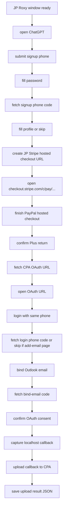

# 先手机号注册 OAuth 接入方案

本文档说明如何把 `GuJumpgate` 新版本插件里的“先手机号注册 OAuth”流程接入当前 `paypal-plus-runner` 项目，并把浏览器 Roxy 出口、Plus checkout 生成、Stripe hosted 长链接和支付页面流量统一调整为 JP 路径。本文只写接入方案，不修改运行时代码。

源流程参考：

- `/Users/leviviya/Desktop/重构插件/GuJumpgate/docs/先手机号注册流程分析.md`
- `GuJumpgate` 中该流程对应 `plusAccountAccessStrategy = "sms_oauth"`

目标项目：

- `/Users/leviviya/Desktop/重构插件/paypal-plus-runner`

## 1. 目标与边界

### 1.1 目标

在 `paypal-plus-runner` 中新增一条独立的 `sms_oauth` flow，完整覆盖：

```text
手机号注册 -> 注册短信验证 -> 填资料 -> Plus checkout -> 从 CPA 获取 OAuth URL -> 手机号 OAuth 登录 -> 登录短信验证或进入添加邮箱 -> 绑定邮箱 -> 邮箱验证码 -> OAuth consent -> localhost callback -> 上传 callback 到 CPA -> 保存回调结果
```

目标行为必须满足：

- OpenAI 账号主身份是手机号，不是邮箱。
- Outlook 邮箱只用于后续绑定邮箱和接收绑定邮箱验证码。
- PayPal 手机号池只用于 PayPal 支付短信，不得复用为 OpenAI 注册或登录手机号。
- OpenAI 注册和 OAuth 登录手机号由新的 OpenAI SMS 接码 provider 管理。
- Roxy 浏览器出口从当前 US 改为 JP。
- checkout conversion 继续使用本地 JP proxy，并且必须生成 Stripe hosted 长链接。
- 支付页面必须打开 `https://checkout.stripe.com/c/pay/...` 类型长链接，不得打开 `https://chatgpt.com/checkout/...` 短链接。
- 最终必须捕获 OAuth localhost callback，并上传到 CPA 管理接口完成账号导入。
- callback JSON 是本地诊断和备份产物，不是最终主目标；最终主目标是 CPA 上传成功。

### 1.2 不做的事

本方案不搬运用户二次开发的邮箱验证码 provider。绑定邮箱验证码能力只定义接口边界：

- 输入目标邮箱、页面显示邮箱、过滤时间戳、session key、重发策略。
- 输出验证码提交成功或明确失败。
- 不关心验证码来自 Outlook、Hotmail、自研服务还是其他 provider。

本方案也不绕过支付风控，不把未确认 Plus 的账号保存为成功账号。

## 2. 当前项目差距

当前 `paypal-plus-runner` 的主流程位于 `src/workflow.js`，步骤是：

```text
open-chatgpt
submit-signup-email
fill-password
fetch-signup-code
fill-profile
plus-checkout-create
plus-checkout-billing
plus-checkout-return
session-json-import
```

它目前是邮箱优先注册流，核心差距如下：

- `submit-signup-email` 只面向邮箱入口，虽然已经使用精确 ChatGPT/OpenAI auth selector，但还没有手机号注册入口切换与手机号提交。
- `fetch-signup-code` 只对接 OpenAI 邮箱验证码 provider，没有 OpenAI 注册短信验证码。
- `workflow.js` 没有 CPA OAuth URL 获取、OAuth 登录、手机号登录短信验证、绑定邮箱、绑定邮箱验证码、OAuth consent 和 CPA callback 上传步骤。
- `worker.js` 每轮只租用一个 Outlook 邮箱和一个 PayPal phone，没有 OpenAI SMS phone activation 生命周期。
- `paypal_phone_pool` 是 PayPal 支付短信资源，当前还限定 US `+1` 格式，不适合作为 OpenAI 注册手机号资源。
- `plus_accounts` 只保存 `email/session_json` 等字段，没有手机号主身份、绑定邮箱、OAuth callback、CPA 上传结果等字段。
- `session-json-import` 读取 ChatGPT `/api/auth/session` 并保存本地 CPA JSON；但 `sms_oauth` 的最终主链路是 OAuth callback 上传到 CPA 管理接口，二者不能混为一谈。
- 当前 checkout conversion 已是 `local_jp_proxy` 并强制 Stripe hosted URL，但浏览器 Roxy 默认仍是 US。

## 3. 目标端到端流程

新增 flow 名称建议保持源项目语义：

```json
{
  "flow": {
    "plusAccountAccessStrategy": "sms_oauth",
    "signupMethod": "phone",
    "plusPaymentMethod": "paypal",
    "smsOauthOutputTarget": "cpa_upload"
  }
}
```

目标步骤建议拆成以下 16 个节点。为了减少歧义，建议不要复用 `submit-signup-email` 的名字表达手机号节点；如果为了兼容历史日志可以保留旧名，也必须在代码中用 `signupMethod=phone` 明确分支。

```text
open-chatgpt
submit-signup-phone
fill-password
fetch-signup-phone-code
fill-profile
plus-checkout-create
plus-checkout-billing
plus-checkout-return
fetch-cpa-oauth-url
oauth-login-phone
fetch-login-phone-code
bind-email
fetch-bind-email-code
confirm-oauth-callback
cpa-platform-verify
callback-json-save
```

`plus-checkout-billing` 和 `plus-checkout-return` 是当前 runner 已有的 PayPal hosted checkout 状态机，应该保留。`GuJumpgate` 的源步骤把 hosted checkout 折叠在 `plus-checkout-create` 后续能力里；当前项目已经把支付自动化拆开，因此目标 runner 需要在 OAuth 登录前先完成现有支付两个节点。

整体状态流：



## 4. JP Roxy 与 JP 支付要求

### 4.1 Roxy 浏览器出口改 JP

当前默认配置在 `src/config.js` 中是：

```json
{
  "roxy": {
    "requiredRegion": "US",
    "requireExitCountry": "US"
  }
}
```

目标改为：

```json
{
  "roxy": {
    "requiredRegion": "JP",
    "requireExitCountry": "JP",
    "proxy": {
      "host": "<jp roxy host>",
      "username_template": "username-region-JP-asn-{ASN}-sid-{SID}-t-20",
      "asn_pools": {
        "JP": []
      }
    }
  }
}
```

验收要求：

- `node src/cli.js roxy:probe --config config.local.json` 必须确认出口 country 是 `JP`。
- `windowInfo.exitCountry` 或 probe 结果不为 `JP` 时，本轮不能开始注册。
- 不能出现注册浏览器走 US，而 checkout conversion 走 JP 的混合链路。

### 4.2 checkout conversion 保持 JP

当前项目已有本地 JP checkout conversion：

```json
{
  "checkoutConversion": {
    "enabled": true,
    "provider": "local_jp_proxy",
    "openUrlPreference": "hosted",
    "requireStripeHostedUrl": true,
    "localJpProxy": {
      "runProbe": true,
      "requireJpExit": true,
      "createStripeHostedUrl": true,
      "preferStripeHostedUrl": true
    }
  }
}
```

必须继续保留：

- `provider = "local_jp_proxy"`
- `localJpProxy.requireJpExit = true`
- `requireStripeHostedUrl = true`
- `localJpProxy.createStripeHostedUrl = true`
- `localJpProxy.preferStripeHostedUrl = true`

`plus-checkout-create` 打开的 URL 必须满足：

```text
https://checkout.stripe.com/c/pay/...
```

如果 `resolveCheckoutOpenTarget()` 拿不到 Stripe hosted URL，必须失败并换号或重试，不得 fallback 到短链接。

### 4.3 PayPal 长链生成区、浏览器出口和账单地址

实测后需要把这三个概念拆开，不能都写成 JP：

- 长链生成区：创建 Stripe hosted checkout session 的 `billing_details.country/currency`。为了让 Stripe hosted 页面出现 PayPal，默认使用 `US/USD`，必要时可切 `DE/EUR`。日区 `JP/JPY` session 可能直接把 PayPal 设为 `never`。
- 浏览器出口：Roxy 浏览器和本地 checkout conversion 代理仍必须是 JP。
- hosted checkout 账单地址：打开 `checkout.stripe.com/c/pay/...` 后，在日本 IP 环境下填写 JP 地址。
- hosted checkout 账号邮箱：Stripe hosted 前置页面不传邮箱，也不填写邮箱字段。Outlook 辅助邮箱只在后续 OAuth `bind-email` 阶段提交和验证。

当前默认策略是：

```json
{
  "roxy": {
    "requireExitCountry": "JP"
  },
  "billing_details": {
    "country": "US",
    "currency": "USD"
  },
  "checkoutProfile": {
    "fallbackAddress": {
      "countryCode": "JP"
    }
  }
}
```

如要尝试德国生成区，可以把生成 payload 改成：

```json
{
  "checkoutConversion": {
    "country": "DE",
    "currency": "EUR"
  }
}
```

需要注意：

- 不能再把 `checkoutConversion.country/currency` 默认改成 `JP/JPY`。如果 PayPal 缺失，优先检查 Stripe iframe 中的 `publicOptions[paymentMethods][paypal]` 是否为 `never`。
- `plus-checkout-billing` 必须先精确找到 `button[data-testid="paypal-accordion-item-button"]`，找不到就停止，不得继续点击订阅按钮。
- 支付页账单国家必须从 `checkoutProfile.fallbackAddress.countryCode` 或真实地址 provider 输出读取；不能硬编码 `US`。

## 5. 资源模型

每个 run 需要三类资源，不能混用。

### 5.1 Outlook 邮箱

用途：

- 绑定到手机号注册的 OpenAI 账号。
- 接收绑定邮箱验证码。
- 最终 CPA 上传结果和 callback JSON 摘要的展示邮箱或文件名标识。

它不是账号初始登录身份。

### 5.2 PayPal phone

用途：

- PayPal hosted checkout 里的短信验证。

它继续使用当前 `paypal_phone_pool`、`src/db/paypal-phone-store.js` 和 `src/providers/paypal-phone-code.js`。该池当前只支持 US `+1`，这是支付短信资源约束，不影响 OpenAI 注册手机号。

### 5.3 OpenAI SMS phone

用途：

- OpenAI 手机号注册。
- OAuth 手机号登录。

它必须新增独立资源层，建议表名：

```sql
CREATE TABLE IF NOT EXISTS openai_phone_activations (
  id INTEGER PRIMARY KEY AUTOINCREMENT,
  provider TEXT NOT NULL DEFAULT '',
  provider_order_id TEXT NOT NULL DEFAULT '',
  phone TEXT NOT NULL DEFAULT '',
  country_code TEXT NOT NULL DEFAULT '',
  dial_code TEXT NOT NULL DEFAULT '',
  local_number TEXT NOT NULL DEFAULT '',
  purpose TEXT NOT NULL DEFAULT '',
  status TEXT NOT NULL DEFAULT 'active',
  run_id TEXT NOT NULL DEFAULT '',
  worker_id TEXT NOT NULL DEFAULT '',
  activation_json TEXT NOT NULL DEFAULT '',
  completed_json TEXT NOT NULL DEFAULT '',
  last_error TEXT NOT NULL DEFAULT '',
  created_at TEXT NOT NULL DEFAULT CURRENT_TIMESTAMP,
  updated_at TEXT NOT NULL DEFAULT CURRENT_TIMESTAMP
);
```

状态建议：

```text
active
completed
cancelled
failed
released
```

OpenAI SMS provider 接口建议：

```js
prepareSignupPhoneActivation({ runId, workerId, countryCandidates, maxPrice })
waitForSignupPhoneCode({ activation, timeoutMs, pollMs })
finalizeSignupPhoneActivationAfterSuccess({ activation })
prepareLoginPhoneActivation({ completedActivation })
waitForLoginPhoneCode({ activation, timeoutMs, pollMs })
finalizeLoginPhoneActivationAfterSuccess({ activation })
cancelPhoneActivation({ activation, reason })
```

关键要求：

- 注册成功后必须保留 `signupPhoneCompletedActivation` 快照。
- OAuth 手机号登录要使用同一号码，或基于 completed activation 重新激活同一号码。
- 停止、失败、超时时必须按 provider 能力取消或释放订单。
- 手机号字段必须保存 E.164、国家、区号、本地号码，供精确填表和复核。

## 6. 状态字段设计

运行态 `context` 建议新增：

```js
{
  signupMethod: "phone",
  accountIdentifierType: "phone",
  accountIdentifier: "+81...",
  signupPhoneNumber: "+81...",
  signupPhoneActivation: {},
  signupPhoneCompletedActivation: {},
  loginPhoneActivation: {},
  email: "bound-email@example.com",
  boundEmail: "bound-email@example.com",
  bindEmailSubmitted: false,
  bindEmailVerificationTargetEmail: "",
  oauthUrl: "",
  cpaOAuthState: "",
  cpaManagementOrigin: "",
  localhostUrl: "",
  cpaUploadResult: {},
  callbackJson: {},
  callbackJsonPath: "",
  callbackJsonFileName: ""
}
```

数据库 `plus_accounts` 建议新增：

```sql
ALTER TABLE plus_accounts ADD COLUMN account_identifier_type TEXT NOT NULL DEFAULT '';
ALTER TABLE plus_accounts ADD COLUMN account_identifier TEXT NOT NULL DEFAULT '';
ALTER TABLE plus_accounts ADD COLUMN signup_phone_number TEXT NOT NULL DEFAULT '';
ALTER TABLE plus_accounts ADD COLUMN bound_email TEXT NOT NULL DEFAULT '';
ALTER TABLE plus_accounts ADD COLUMN cpa_upload_status TEXT NOT NULL DEFAULT '';
ALTER TABLE plus_accounts ADD COLUMN cpa_upload_json TEXT NOT NULL DEFAULT '';
ALTER TABLE plus_accounts ADD COLUMN callback_json TEXT NOT NULL DEFAULT '';
ALTER TABLE plus_accounts ADD COLUMN callback_json_path TEXT NOT NULL DEFAULT '';
```

`run_history` 建议新增：

```sql
ALTER TABLE run_history ADD COLUMN account_identifier_type TEXT NOT NULL DEFAULT '';
ALTER TABLE run_history ADD COLUMN account_identifier TEXT NOT NULL DEFAULT '';
ALTER TABLE run_history ADD COLUMN cpa_upload_status TEXT NOT NULL DEFAULT '';
ALTER TABLE run_history ADD COLUMN callback_json_path TEXT NOT NULL DEFAULT '';
```

身份约束：

- `accountIdentifierType` 在整个 `sms_oauth` 主流程中必须保持 `phone`。
- `email` 和 `boundEmail` 只能表示绑定邮箱，不能覆盖 `accountIdentifier`。
- 任何步骤试图把手机号主身份静默切到邮箱，都应该抛出错误。

## 7. 步骤改造方案

### 7.1 open-chatgpt

复用当前 `src/steps/open-chatgpt.js`，但进入 flow 前增加 JP Roxy 断言：

- Roxy probe country 必须是 `JP`。
- 当前页面 host 必须是 ChatGPT/OpenAI 支持域，不能在 Google/Microsoft/Apple 第三方登录 detour 中继续。
- 每次页面跳转后继续调用 `observePageState()` 并写入日志。

### 7.2 submit-signup-phone

新增 `src/steps/submit-signup-phone.js`，从 `GuJumpgate` 的手机号注册入口逻辑迁移核心行为：

- 打开或恢复 OpenAI auth/signup 页面。
- 点击精确的手机号注册入口，不能用“任意可见 input/button”泛化匹配。
- 从 OpenAI SMS provider 获取手机号 activation。
- 根据 activation 的 country/dial code/local number 精确选择国家区号。
- 填写本地号码到可见手机号输入框。
- 同步 hidden phone input 或 React state。
- 提交前复核可见号码、hidden 值、国家区号和提交按钮。
- 成功后写入 `accountIdentifierType="phone"`、`accountIdentifier`、`signupPhoneNumber`、`signupPhoneActivation`。

精确 selector 策略：

- 优先使用稳定属性：`data-testid`、`id`、`name`、`type`、`aria-label`。
- 手机入口切换按钮必须限定在 OpenAI auth 表单范围内。
- 选择国家时必须读取当前选中的 country/dial code，不允许只按文本模糊点击。
- 如果页面 HTML 不符合已知结构，保存 artifact 并失败，不做泛化 fallback。

### 7.3 fill-password

扩展当前 `src/steps/fill-password.js`：

- payload 必须支持 `identifierType="phone"`。
- 账号记录使用 `signupPhoneNumber/accountIdentifier`，不再要求邮箱是主身份。
- 页面状态若已经进入验证码页或已登录，可按现有恢复策略跳过或继续。

### 7.4 fetch-signup-phone-code

新增 `src/steps/fetch-signup-phone-code.js`：

- 只处理 OpenAI 手机号注册验证码页。
- 调用 OpenAI SMS provider 轮询注册验证码。
- 用精确验证码输入框和提交按钮填入验证码。
- 验证成功后 finalize activation。
- 写入 `signupPhoneCompletedActivation`。
- 清理 `signupPhoneActivation` 运行态。

禁止行为：

- 不得调用 Outlook 邮箱验证码 provider。
- 不得在手机号验证码失败后 fallback 到邮箱验证码。
- 不得在国家/号码不匹配时继续提交。

### 7.5 fill-profile

复用当前 `src/steps/fill-profile.js`，但需要确认：

- 手机号验证码提交后可能直接进入 profile 页面。
- 也可能直接到 ChatGPT home、onboarding 或 callback 页面。
- 已登录或资料已完成时必须短路跳过。

### 7.6 plus-checkout-create

复用当前 `src/steps/create-plus-checkout.js`，但增加 `sms_oauth` 约束：

- 创建 checkout 前必须确认当前 ChatGPT session 属于手机号注册账号。
- `createCheckout()` 必须走 `local_jp_proxy`。
- `resolveCheckoutOpenTarget()` 返回的 URL 必须是 Stripe hosted 长链接。
- 打开的目标必须是 `checkout.stripe.com/c/pay/...`。
- 日志只记录 URL 类型和 checkout session 是否存在，不输出完整 URL。

配置要求：

```json
{
  "checkoutConversion": {
    "provider": "local_jp_proxy",
    "country": "JP",
    "currency": "JPY",
    "openUrlPreference": "hosted",
    "requireStripeHostedUrl": true,
    "localJpProxy": {
      "requireJpExit": true,
      "createStripeHostedUrl": true,
      "preferStripeHostedUrl": true
    }
  }
}
```

### 7.7 plus-checkout-billing

复用当前 `src/steps/fill-plus-checkout.js` 和 PayPal content script。

注意：

- PayPal phone pool 仍只服务支付短信。
- 支付页面继续在同一个 JP Roxy browser page 中执行。
- 如果 PayPal 风控或 DataDome 出现，保持现有 `PAYPAL_RISK_BLOCKED` 行为，不能保存成功账号。

### 7.8 plus-checkout-return

复用当前 `src/steps/plus-return-confirm.js`：

- 确认 Plus return 或 `/payments/success`。
- 再校验 `/api/auth/session` plan。
- 完成后不要直接结束 run，而是进入 OAuth 登录。

### 7.9 fetch-cpa-oauth-url

新增 `src/steps/fetch-cpa-oauth-url.js`，职责是从 CPA 管理接口获取 OpenAI OAuth 授权链接。

配置来源：

- `/Users/leviviya/Documents/gpt/playwright/config.json` 中的 `oauth_cpa.base_url` 对应目标项目 `cpa.baseUrl`。
- 同文件中的 `oauth_cpa.authorization_bearer` 对应目标项目 `cpa.authorizationBearer`。
- 文档和日志不得写入真实 bearer 值；配置文件中由用户本地保存。

目标配置：

```json
{
  "cpa": {
    "baseUrl": "http://127.0.0.1:8317",
    "authorizationBearer": "<从本地 config.json 读取或手动配置>",
    "timeoutMs": 30000,
    "uploadLockTimeoutMs": 900000,
    "workerAccountOauthTimeoutMs": 600000,
    "multiStateSupported": true
  }
}
```

CPA 获取 OAuth URL 接口按源插件语义对齐：

```text
GET /v0/management/codex-auth-url
Authorization: Bearer <authorizationBearer>
X-Management-Key: <authorizationBearer>
```

响应兼容字段：

```js
oauthUrl = result.url || result.auth_url || result.authUrl || result.data?.url || result.data?.auth_url || result.data?.authUrl
cpaOAuthState = result.state || result.auth_state || result.authState || result.data?.state || result.data?.auth_state || result.data?.authState || stateFromOauthUrl
```

步骤输出：

- `context.oauthUrl`
- `context.cpaOAuthState`
- `context.cpaManagementOrigin`

强约束：

- 没有 `cpa.baseUrl` 必须失败。
- 没有 `cpa.authorizationBearer` 必须失败。
- CPA 未返回有效 `auth_url` 必须失败。
- 日志只记录 `baseUrl` origin 和是否拿到 state，不记录完整 OAuth URL。

### 7.10 oauth-login-phone

新增 `src/steps/oauth-login-phone.js`：

- 使用 `fetch-cpa-oauth-url` 写入的 `oauthUrl`。
- 打开 OAuth URL。
- 使用手机号作为登录身份。
- 如果页面是邮箱登录入口，必须精确切换到手机号登录入口。
- 填写同一个 `signupPhoneNumber`。
- 填写密码。
- 提交后识别以下状态：
  - 手机验证码页：进入 `fetch-login-phone-code`。
  - 添加邮箱页：跳过登录短信，进入 `bind-email`。
  - OAuth consent 页：跳过登录短信和绑定邮箱。
  - 添加手机号页：报错，因为手机号注册模式不应补手机号。
- 邮箱验证码页：报错，因为手机号 OAuth 登录不应 fallback 邮箱验证码。

### 7.11 fetch-login-phone-code

新增 `src/steps/fetch-login-phone-code.js`：

- 只处理手机号登录短信验证码。
- 从 `signupPhoneCompletedActivation` 找到原手机号。
- 调用 provider 复用或重新激活该号码。
- 轮询登录短信验证码。
- 精确提交验证码。
- 成功后刷新 completed activation 快照。

如果当前页面已经是添加邮箱页或 OAuth consent 页，本步骤可返回 skipped，但必须记录页面状态。

### 7.12 bind-email

新增 `src/steps/bind-email.js`：

- 只在 `add_email_page` 执行。
- 使用当前租用的 Outlook 邮箱作为绑定邮箱。
- 提交前确认账号主身份仍是手机号。
- 提交后写入 `boundEmail`、`bindEmailSubmitted=true`、`bindEmailVerificationTargetEmail`。

如果已经在 OAuth consent 页：

- 可以跳过绑定邮箱。
- 但必须记录 `reason="oauth_consent_already_ready"`。

### 7.13 fetch-bind-email-code

新增 `src/steps/fetch-bind-email-code.js`：

- 只处理绑定邮箱后的邮箱验证码页。
- 调用用户二次开发的邮箱验证码 provider。
- 使用 `boundEmail` 和页面显示邮箱做双重校验。
- 验证码过滤时间必须晚于 `bindEmailSubmittedAt`。
- 提交成功后清理绑定邮箱验证码运行态。

禁止行为：

- 不能把邮箱验证码失败 fallback 到手机号短信。
- 不能在未执行 `bind-email` 的情况下盲取邮箱验证码。
- 页面不是验证码页时不能泛化寻找任意 code input。

### 7.14 confirm-oauth-callback

新增 `src/steps/confirm-oauth-callback.js`：

- 只处理 OAuth consent 页。
- 精确定位 consent form 和继续按钮。
- 点击后监听 localhost callback。
- 捕获完整 callback URL，但日志只能脱敏显示 host、path、是否有 `code/state`。
- 写入 `localhostUrl`。

如果点击后页面回到手机号验证码、添加邮箱或邮箱验证码页：

- 最多做一次显式状态恢复。
- 仍失败则回到对应前置节点，不能在 consent 节点里混做验证码或绑定邮箱。

### 7.15 cpa-platform-verify

新增 `src/steps/cpa-platform-verify.js`，职责是把 `confirm-oauth-callback` 捕获的 localhost callback 上传到 CPA。

CPA 上传 callback 接口按源插件语义对齐：

```text
POST /v0/management/oauth-callback
Authorization: Bearer <authorizationBearer>
X-Management-Key: <authorizationBearer>
Content-Type: application/json

{
  "provider": "codex",
  "redirect_url": "<localhost callback url>"
}
```

上传前校验：

- `localhostUrl` 必须存在。
- `localhostUrl` 必须是 localhost OAuth callback URL。
- callback 必须包含 `code`。
- 如果 `context.cpaOAuthState` 存在，callback 里的 `state` 必须与它一致。
- `cpa.baseUrl` 和 `cpa.authorizationBearer` 必须存在。

上传结果：

```js
{
  status: "done",
  target: "cpa",
  cpaUploadStatus: "done",
  verifiedStatus: result.message || result.status_message || "CPA 已通过接口提交回调",
  responseJson: result
}
```

失败处理：

- HTTP 非 2xx：本 run 失败，不保存成功账号。
- CPA 返回 state/code 错误：本 run 失败，建议重新从 `fetch-cpa-oauth-url` 开始。
- CPA 超时：按 retryable 外部错误处理。

日志要求：

- 不输出完整 callback URL。
- 不输出 `code/state`。
- 不输出 authorization bearer。
- 只记录 `hasCode`、`hasState`、`stateMatched`、HTTP 状态和 CPA 返回摘要。

### 7.16 callback-json-save

新增 `src/steps/callback-json-save.js`，职责是保存本地诊断 JSON。该步骤不是最终上传主目标，最终主目标已经在 `cpa-platform-verify` 完成。

有两种保存模式：

模式 A：保存 callback 捕获摘要。

```json
{
  "type": "oauth_callback",
  "provider": "openai",
  "email": "bound-email@example.com",
  "accountIdentifierType": "phone",
  "accountIdentifier": "+81...",
  "localhostUrl": "http://localhost:.../callback?...",
  "hasCode": true,
  "hasState": true,
  "createdAt": "..."
}
```

该模式不交换 token，只证明 OAuth callback 已捕获。

模式 B：保存 CPA 上传结果摘要。

```json
{
  "type": "cpa_upload_result",
  "target": "cpa",
  "email": "bound-email@example.com",
  "accountIdentifierType": "phone",
  "accountIdentifier": "+81...",
  "cpa": {
    "baseUrl": "http://127.0.0.1:8317",
    "uploaded": true,
    "verifiedStatus": "CPA 已通过接口提交回调"
  },
  "createdAt": "..."
}
```

本地 JSON 只保存脱敏摘要。完整 `redirect_url`、`code`、`state`、bearer 不写入文件。

建议配置：

```json
{
  "callbackJson": {
    "enabled": true,
    "dir": "callback-json",
    "mode": "cpa_upload_summary",
    "redactSecretsInLogs": true
  }
}
```

文件命名建议：

```text
callback-json/oauth-<bound-email>-plus.json
```

注意：

- `callbackJson` 和当前 `sessionJson` 是两个产物。
- CPA 上传成功是主验收；本地 callback JSON 是诊断和备份。
- 如果同时需要本地 CPA auth JSON，可以在 CPA 上传成功后继续调用现有 `session-json-import`。
- 日志和 CLI 输出必须脱敏 `code`、`state`、access token、refresh token、session token 和完整 checkout URL。

## 8. 精确 HTML 元素控制策略

后续实现必须延续当前项目对 ChatGPT 登录入口的严格 selector 思路，不能回到泛化匹配。

通用规则：

- 每个页面先执行 `observePageState()`，记录 URL、host、可识别 stage、关键表单计数。
- 每个步骤只操作自己负责的已知页面状态。
- selector 必须限定在具体 form、dialog 或 page section 内。
- 对按钮使用精确 role、type、data-testid、aria-label、表单归属和文本排除规则。
- 对输入框使用 `id/name/type/autocomplete/aria-label` 等组合。
- 第三方 OAuth host 必须直接识别为 detour，不在其页面上填写邮箱或手机号。
- 页面进入下一阶段后立刻再次观察页面状态。
- 找不到精确元素时保存 HTML 和截图 artifact，然后失败。

建议为每类页面建立 detector：

```js
detectSignupPhoneEntrySurface(page)
detectPhoneVerificationSurface(page)
detectOAuthLoginPhoneSurface(page)
detectAddEmailSurface(page)
detectEmailVerificationSurface(page)
detectOAuthConsentSurface(page)
detectCallbackSurface(page)
```

每个 detector 输出：

```js
{
  url,
  host,
  stage,
  isSupportedOpenAIHost,
  isThirdPartyOAuthDetour,
  exactFormCount,
  exactInputCount,
  exactSubmitCount,
  ready,
  reason
}
```

只有 `ready=true` 时允许执行 DOM action。

## 9. 配置改造清单

建议新增或调整：

```json
{
  "flow": {
    "plusAccountAccessStrategy": "sms_oauth",
    "signupMethod": "phone",
    "smsOauthOutputTarget": "cpa_upload"
  },
  "roxy": {
    "requiredRegion": "JP",
    "requireExitCountry": "JP",
    "proxy": {
      "host": "<jp roxy host>",
      "username_template": "username-region-JP-asn-{ASN}-sid-{SID}-t-20"
    }
  },
  "checkoutConversion": {
    "provider": "local_jp_proxy",
    "country": "JP",
    "currency": "JPY",
    "requireStripeHostedUrl": true,
    "localJpProxy": {
      "requireJpExit": true,
      "createStripeHostedUrl": true,
      "preferStripeHostedUrl": true
    }
  },
  "openaiPhone": {
    "enabled": true,
    "providerOrder": ["chatgpt-api"],
    "countryCandidates": ["JP"],
    "pollIntervalMs": 3000,
    "pollTimeoutMs": 180000,
    "autoCancelOnFailure": true,
    "reuseCompletedActivationForLogin": true
  },
  "callbackJson": {
    "enabled": true,
    "dir": "callback-json",
    "mode": "cpa_upload_summary"
  },
  "cpa": {
    "baseUrl": "http://127.0.0.1:8317",
    "authorizationBearer": "<local secret>",
    "timeoutMs": 30000
  }
}
```

如果 OpenAI 注册手机号必须使用非 JP 国家，`openaiPhone.countryCandidates` 可以独立配置，但 Roxy 和 checkout 仍必须是 JP。

## 10. 数据库与存储改造清单

新增：

- `openai_phone_activations`：保存 OpenAI SMS activation 生命周期。
- `callback-json/.gitkeep`：本地 callback JSON 输出目录。
- `run_events`：保存每个窗口、账号、步骤、页面观察和资源状态事件，供前端监控页实时展示。

调整：

- `plus_accounts` 增加手机号主身份、绑定邮箱和 callback JSON 字段。
- `run_history` 增加账号主身份、CPA 上传状态和 callback JSON 路径字段。
- `insertPlusAccount()` 改为支持 `result.cpaUploadResult`、`result.callbackJson`、`result.boundEmail`、`result.accountIdentifierType`。
- `safe-output` 脱敏规则增加 `callbackJson`、`localhostUrl`、`code`、`state`、`callback_json`。

不要调整：

- `paypal_phone_pool` 不承担 OpenAI 手机号注册职责。
- `outlook_emails` 仍是邮箱库存表，可继续作为绑定邮箱来源。

建议新增事件表：

```sql
CREATE TABLE IF NOT EXISTS run_events (
  id INTEGER PRIMARY KEY AUTOINCREMENT,
  run_id TEXT NOT NULL DEFAULT '',
  worker_id TEXT NOT NULL DEFAULT '',
  roxy_dir_id TEXT NOT NULL DEFAULT '',
  account_email TEXT NOT NULL DEFAULT '',
  account_identifier_type TEXT NOT NULL DEFAULT '',
  account_identifier TEXT NOT NULL DEFAULT '',
  step TEXT NOT NULL DEFAULT '',
  level TEXT NOT NULL DEFAULT 'info',
  event_type TEXT NOT NULL DEFAULT '',
  message TEXT NOT NULL DEFAULT '',
  page_stage TEXT NOT NULL DEFAULT '',
  page_url_redacted TEXT NOT NULL DEFAULT '',
  payload_json TEXT NOT NULL DEFAULT '',
  created_at TEXT NOT NULL DEFAULT CURRENT_TIMESTAMP
);
```

事件表只保存脱敏信息。完整 token、验证码、refresh token、OAuth `code/state`、完整 checkout URL 和完整 localhost callback URL 都不能落入 `payload_json`。

## 11. 前端运行监控页面方案

需要新增一个本地前端页面，用于观察每个 Roxy 窗口里账号从开始到结束的完整过程。它不是替代 CLI，而是给 E2E 和批量运行提供实时控制台。

### 11.1 页面目标

前端页面需要回答这些问题：

- 当前开了几个 Roxy 窗口。
- 每个窗口正在跑哪个账号。
- 账号当前走到哪一步。
- 当前页面是什么状态，是否跳到了错误页面。
- 当前 Roxy 出口是否为 JP。
- 当前 checkout 是否生成了 `checkout.stripe.com/c/pay/...` 长链接。
- PayPal 是否进入风控、短信验证、review consent 或 success。
- OAuth 是否进入手机号登录、添加邮箱、邮箱验证码、consent 或 callback。
- 是否已经从 CPA 获取 OAuth URL。
- localhost callback 是否已经上传到 CPA。
- 成功后 CPA 上传结果和 callback JSON 摘要保存在哪里。
- 失败后 artifact 在哪里，错误是否可重试。

### 11.2 推荐页面结构

建议做成单页本地控制台，名字可以是 `Runner Console`。

顶部总览：

- 运行状态：idle、running、stopping、done。
- 并发窗口数、活跃 run 数、成功数、失败数、重试数。
- Outlook 库存、PayPal phone 库存、OpenAI SMS activation 活跃数。
- JP Roxy probe 状态。
- JP checkout probe 状态。
- 最近一个 blocker，例如 PayPal risk、SMS timeout、selector mismatch。

窗口卡片区：

- 每个 Roxy window 一张卡片。
- 展示 `workerId`、`roxyDirId`、出口 IP、出口国家、ASN、SID。
- 展示当前账号绑定邮箱、账号主身份类型、手机号脱敏值。
- 展示当前步骤、步骤耗时、重试次数。
- 展示当前页面 stage 和脱敏 URL。
- 展示 CPA 状态：未获取 OAuth URL、已获取、callback 已捕获、上传中、上传成功、上传失败。
- 展示最近截图缩略图，如果有 failure artifact 可以点击打开。

账号时间线：

- 每个账号一条步骤 timeline。
- 步骤包括 `open-chatgpt`、`submit-signup-phone`、`fetch-signup-phone-code`、`plus-checkout-create`、`plus-checkout-billing`、`plus-checkout-return`、`fetch-cpa-oauth-url`、`oauth-login-phone`、`bind-email`、`confirm-oauth-callback`、`cpa-platform-verify`、`callback-json-save`。
- 每个步骤状态是 pending、running、done、skipped、retrying、failed。
- 每个步骤显示开始时间、结束时间、耗时、关键输出。

资源面板：

- Outlook 邮箱：new、running、plus_done、failed。
- PayPal phone：active、leased、released、last_error。
- OpenAI SMS：active、completed、cancelled、failed。
- 每个 run 绑定的三类资源必须一眼能看出来。

日志面板：

- 按 run、worker、step、level 过滤。
- 展示页面观察事件、selector 检测结果、checkout URL 类型、SMS provider 状态、callback 捕获状态。
- 所有敏感字段必须脱敏。

产物面板：

- 成功账号的 CPA 上传结果。
- 成功账号的 callback JSON 摘要路径。
- 可选 CPA JSON 路径。
- session JSON 是否存在，但不展示内容。
- failure artifact 目录、截图、HTML snapshot。

控制区：

- 启动 run：选择并发数、limit、是否 dry-run。
- 停止：请求 graceful stop，不直接杀进程。
- 单账号重试：只允许对明确可重试失败执行。
- 打开 artifact：只打开本地文件，不把敏感内容复制到页面日志。

### 11.3 数据来源

后端建议提供一个轻量本地服务，读取 SQLite 和内存运行状态：

```text
GET /api/summary
GET /api/windows
GET /api/runs?status=running
GET /api/runs/:runId
GET /api/runs/:runId/events
GET /api/runs/:runId/artifacts
GET /api/resources/outlook
GET /api/resources/paypal-phones
GET /api/resources/openai-phones
```

实时更新可以用 SSE：

```text
GET /api/events/stream
```

runner 每完成以下动作都写入 `run_events` 并推送 SSE：

- run 创建、开始、完成、失败。
- worker 绑定 Roxy window。
- 租用 Outlook、PayPal phone、OpenAI phone activation。
- 每个步骤开始、完成、跳过、失败。
- 每次页面跳转后的 `observePageState()`。
- checkout URL 创建结果，只记录 `targetType=hosted` 和 `isStripeHosted=true`。
- CPA OAuth URL 获取结果，只记录 `hasOauthUrl`、`hasState` 和 `origin`。
- PayPal stage 变化。
- OAuth stage 变化。
- callback 捕获成功，只记录 `hasCode=true`、`hasState=true`。
- CPA callback 上传结果，只记录 `uploaded=true/false` 和返回摘要。
- JSON 文件保存成功。

### 11.4 前端技术建议

当前项目是 Node CLI 项目，建议先做最小本地 Web UI：

- `src/ui/server.js`：本地 HTTP/SSE server。
- `src/ui/public/`：静态前端资源。
- 不强制引入大型前端框架，第一版可以用原生 HTML/CSS/JS。
- 如果后续页面复杂，再迁移到 Vite。

第一版命令建议：

```bash
node src/cli.js ui --config config.local.json
```

打开：

```text
http://127.0.0.1:<port>
```

### 11.5 页面视觉和交互要求

页面需要偏运维控制台，而不是普通表格页：

- 每个窗口用独立卡片，状态颜色清晰区分 running、done、failed、retrying。
- 时间线要能快速看出卡在哪一步。
- 错误卡片必须突出当前 blocker 和下一步建议。
- 页面状态要显示 detector 结果，例如 `phone_verification_page`、`add_email_page`、`oauth_consent_page`。
- checkout 链接只显示类型，不显示完整 URL。
- callback 只显示是否捕获，不显示完整 `code/state`。
- 支持只看失败、只看运行中、按邮箱搜索、按 worker 搜索。

### 11.6 前端验收标准

前端页面完成后，至少要满足：

- 并发 1 运行时，页面能看到单个账号完整时间线。
- 并发 7 运行时，页面能区分每个 Roxy window 的账号和步骤。
- 每次页面跳转后，前端能显示最新 page stage。
- Stripe hosted 长链接生成后，前端显示 `checkout.stripe.com/c/pay` 类型，但不显示完整 URL。
- OAuth callback 捕获后，前端显示 callback JSON 路径。
- CPA 上传成功后，前端显示 CPA 已接收 callback 和返回摘要。
- 失败时能从前端打开对应 artifact 目录。
- 日志、事件、页面展示均不泄漏 token、验证码、完整 callback URL、完整 checkout URL。

## 12. 错误处理与释放策略

OpenAI SMS activation：

- 注册手机号提交前失败：取消 activation。
- 注册短信超时：按 provider 能力取消 activation，账号标记 retryable。
- 注册短信成功后：finalize activation，保存 completed 快照。
- OAuth 登录短信失败：释放或取消 login activation，但保留 signup completed 快照供诊断。
- 用户停止流程：按 `openaiPhone.autoCancelOnFailure` 决定取消还是保留。

Outlook 邮箱：

- 绑定邮箱前失败：可按当前 retry 规则恢复。
- 绑定邮箱已提交但验证码失败：标记 failed 或 retryable 需谨慎，因为邮箱可能已经绑定到该手机号账号。

PayPal phone：

- 维持当前 lease/release 逻辑。
- PayPal 风控失败时释放 PayPal phone，不保存成功账号。

Roxy：

- 任一步骤检测到出口不是 JP，立即失败并按代理失败处理。
- 支付风控可以触发当前 `rotateProxyOnRiskErrors`。

前端事件：

- 所有失败都必须写入 `run_events`。
- 所有资源释放都必须写入 `run_events`。
- 如果 artifact 写入失败，也要写事件说明 artifact capture failed。

## 13. 实施顺序

建议按以下顺序落地：

1. 新增配置项和 schema migration，不改变默认旧 flow。
2. 新增 OpenAI SMS provider 接口和 `openai_phone_activations` store。
3. 新增 flow resolver，让 `sms_oauth` 生成目标步骤列表。
4. 新增 `submit-signup-phone` 和手机号注册页面 detector。
5. 新增 `fetch-signup-phone-code`，跑通手机号注册到登录态。
6. 新增 `run_events` 和运行事件写入接口。
7. 把 Roxy 默认和 example 的目标配置改 JP，并保证 `roxy:probe` 验证 JP。
8. 把 checkout payload 配置切到 `JP/JPY`，保留配置开关以便 promo 兼容回滚。
9. 复用现有 PayPal hosted checkout，确认仍打开 Stripe hosted 长链接。
10. 新增 CPA provider：读取 `cpa.baseUrl`、`cpa.authorizationBearer`，实现获取 OAuth URL 和上传 callback。
11. 新增 `fetch-cpa-oauth-url`。
12. 新增 `oauth-login-phone` 和 `fetch-login-phone-code`。
13. 新增 `bind-email` 和 `fetch-bind-email-code`，接入用户二次开发邮箱验证码 provider。
14. 新增 `confirm-oauth-callback`、`cpa-platform-verify` 和 `callback-json-save`。
15. 扩展 `plus_accounts`、`run_history`、CLI 输出和本地 JSON 保存。
16. 新增本地前端监控页和 SSE/API。
17. 补单元测试、页面 detector 静态 HTML 测试、前端 API 测试和小并发 E2E。

## 14. 测试计划

### 13.1 单元测试

新增测试：

- `sms-oauth-workflow.test.js`：步骤顺序严格匹配目标 flow。
- `openai-phone-store.test.js`：activation lease、finalize、cancel、retry。
- `signup-phone-selector.test.js`：手机号注册入口 detector 只接受精确 HTML。
- `oauth-phone-selector.test.js`：手机号 OAuth 登录 detector。
- `callback-json.test.js`：callback URL 脱敏、JSON 保存、文件名生成。
- `cpa-oauth-upload.test.js`：CPA OAuth URL 获取、state 校验、callback 上传、错误摘要和脱敏。
- `safe-output.test.js`：`code/state/localhostUrl/callbackJson` 脱敏。
- `run-events.test.js`：运行事件写入、脱敏和按 run 查询。
- `ui-api.test.js`：summary、windows、runs、events API 返回脱敏数据。

保留并扩展：

- `checkout-conversion.test.js`：要求 Stripe hosted URL。
- `paypal-risk.test.js`：支付风控不保存成功。
- `profile-and-checkout-recovery.test.js`：Plus return 后还能进入 OAuth 阶段。

### 14.2 非破坏性预检

```bash
npm run check
node src/cli.js roxy:probe --config config.local.json
node src/cli.js checkout:probe --config config.local.json
node src/cli.js start --config config.local.json --windows 1 --limit 1 --dry-run
node src/cli.js ui --config config.local.json
```

预检通过条件：

- Roxy probe country 是 `JP`。
- Checkout probe country 是 `JP`。
- Checkout target 类型是 Stripe hosted。
- dry-run 能规划 `sms_oauth` 步骤，不租用真实 SMS activation。
- UI 能读取 summary、窗口列表和 dry-run 事件。

### 14.3 真实 E2E

第一轮：

```bash
node src/cli.js start --config config.local.json --windows 1 --limit 1
```

每个页面跳转后必须看页面状态：

- `open-chatgpt` 后观察是否在 OpenAI/ChatGPT 域。
- `submit-signup-phone` 后观察是否进入密码页或手机号验证码页。
- `fetch-signup-phone-code` 后观察是否进入 profile、home 或已登录页。
- `plus-checkout-create` 后观察 URL 是否是 `checkout.stripe.com/c/pay/...`。
- `plus-checkout-billing` 后观察 PayPal stage。
- `plus-checkout-return` 后观察 Plus session 是否生效。
- `oauth-login-phone` 后观察是手机验证码页、添加邮箱页还是 consent 页。
- `bind-email` 后观察是否进入邮箱验证码页。
- `confirm-oauth-callback` 后确认捕获 localhost callback。
- `cpa-platform-verify` 后确认 CPA 接口接收 callback。
- `callback-json-save` 后确认 JSON 摘要文件存在且不泄漏敏感字段到日志。
- 前端页面同步显示每个步骤状态、页面 stage、artifact 和 callback JSON 路径。

第二轮：

- 只在第一轮成功后恢复并发。
- 并发从 1 -> 2 -> 5 -> 7 逐级增加。
- 每级至少保留失败 artifact，并更新 `docs/E2E_TEST_MEMORY.md`。

## 15. 验收标准

功能验收：

- `sms_oauth` flow 步骤顺序固定且可测试。
- 账号主身份始终是手机号。
- 注册短信和登录短信都走 OpenAI SMS provider。
- 绑定邮箱验证码走用户二次开发邮箱 provider。
- Plus checkout 在 OAuth 登录前完成。
- Checkout 创建和 Stripe init 都确认 JP 出口。
- 浏览器 Roxy 出口确认 JP。
- 打开的支付 URL 必须是 `checkout.stripe.com/c/pay/...`。
- OAuth consent 后能捕获 localhost callback。
- localhost callback 能上传到 CPA。
- 本地生成 callback/CPA 上传摘要 JSON。
- 本地前端页面能展示每个窗口、账号、步骤、资源、页面状态、artifact 和 callback JSON。

安全与日志验收：

- 不输出完整 checkout URL。
- 不输出完整 localhost callback URL。
- 不输出 `code`、`state`、access token、refresh token、session token、邮箱 refresh token。
- 失败时保存 artifact，但 CLI 输出继续脱敏。
- 前端 API、SSE 和页面展示继续脱敏敏感字段。

数据验收：

- 成功账号写入 `plus_accounts`，包含手机号主身份、绑定邮箱、callback JSON 路径。
- PayPal phone 正确释放。
- OpenAI SMS activation 正确 finalize 或取消。
- 失败 run 不保存 Plus 成功账号。
- `run_events` 记录完整步骤过程，可被前端按窗口和账号还原时间线。
- `plus_accounts` 和 `run_history` 保存 CPA 上传状态和返回摘要。

E2E 验收：

- 并发 1 至少完整成功一次。
- 成功结果包含 CPA 上传成功状态和 callback JSON 摘要文件。
- 并发 7 时前端页面能正确区分每个窗口的账号过程。
- 如支付风控出现，run 必须失败并释放资源，不能误保存成功。

## 16. 实施时最容易出错的点

- 把 `email` 当成账号主身份，导致 OAuth 登录错误使用邮箱。
- 把 PayPal phone pool 当成 OpenAI 注册手机号池。
- 手机号验证码失败后 fallback 到邮箱验证码。
- OAuth 登录进入添加邮箱页时误判为失败。
- 绑定邮箱后把 `accountIdentifierType` 改成 `email`。
- checkout conversion 是 JP，但 Roxy 浏览器仍是 US。
- 生成了 `pay.openai.com` 或 `chatgpt.com/checkout` 链接却继续支付。
- 没有在页面跳转后立即观察页面状态，导致错误页面继续被后续步骤泛化操作。
- 输出 callback URL 时泄漏 `code/state`。
- 把本地 callback JSON 当成最终目标，漏掉 CPA 上传。
- 从 CPA 获取新的 OAuth URL 后，没有校验 callback `state`，导致上传串号。
- 前端页面直接展示完整 token、验证码、checkout URL 或 callback URL。
- 前端只按账号聚合，不按 Roxy window 聚合，导致并发时看不清每个窗口卡在哪里。

## 17. 结论

`sms_oauth` 不是“邮箱注册换成手机号”的小改动，而是一条独立身份链路。当前项目应把它实现为独立 flow：手机号负责 OpenAI 注册和 OAuth 登录，Outlook 邮箱负责绑定与验证码，PayPal phone 只负责支付短信，JP Roxy 和 JP checkout conversion 共同保证注册、支付和长链接生成都在目标地区路径下执行。最终主目标是把 OAuth localhost callback 上传到 CPA 管理接口完成账号导入，本地 callback JSON 只是诊断和备份产物。前端监控页应作为这条链路的实时可视化控制台，让并发窗口、账号步骤、页面状态、资源租用、CPA 上传状态、失败 artifact 和最终 JSON 产物都可以被快速定位。
